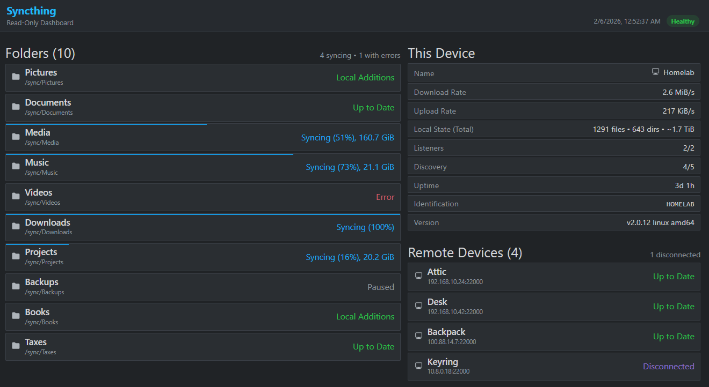

# Syncthing Dashboard

A small read-only dashboard for Syncthing status.



## Quick start


Example with Docker Compose:

```yaml
services:
  dashboard:
    image: ghcr.io/fdcastel/syncthing-dashboard:latest
    restart: unless-stopped
    ports:
      - "8080:8080"
    environment:
      SYNCTHING_BASE_URL: http://host.docker.internal:8384
      SYNCTHING_API_KEY: ${SYNCTHING_API_KEY}
    extra_hosts:
      - "host.docker.internal:host-gateway"
```

## Main configuration

- `SYNCTHING_BASE_URL`: Syncthing base URL from dashboard backend perspective.
  - If omitted, demonstration mode is enabled automatically.
- `SYNCTHING_API_KEY` or `SYNCTHING_API_KEY_FILE`: Syncthing API key.

## Additional options

- `SYNCTHING_TIMEOUT`: timeout for Syncthing API requests (default `8s`).
- `SYNCTHING_INSECURE_SKIP_VERIFY`: skip TLS verification for Syncthing HTTPS (default `false`).
- `SYNCTHING_DASHBOARD_POLL_INTERVAL`: dashboard poll interval (default `5s`).
  - Supports Go duration format (e.g. `2s`) or plain seconds (e.g. `2`).
- `SYNCTHING_DASHBOARD_LISTEN_ADDRESS`: dashboard listen address (default `:8080`).
- `SYNCTHING_DASHBOARD_READ_TIMEOUT`: dashboard HTTP read timeout (default `10s`).
- `SYNCTHING_DASHBOARD_WRITE_TIMEOUT`: dashboard HTTP write timeout (default `10s`).
- `SYNCTHING_DASHBOARD_TITLE`: top-left page title (default `Syncthing`).
- `SYNCTHING_DASHBOARD_SUBTITLE`: top-left page subtitle (default `Read-Only Dashboard`).

Defaults in `docker-compose.yml`:
- `SYNCTHING_BASE_URL=` (if empty, demonstration mode is enabled)
- `SYNCTHING_DASHBOARD_POLL_INTERVAL=5s`
- `SYNCTHING_DASHBOARD_LISTEN_ADDRESS=:8080`
- `SYNCTHING_DASHBOARD_TITLE=Syncthing`
- `SYNCTHING_DASHBOARD_SUBTITLE=Read-Only Dashboard`

If running the Go binary directly on the same host as Syncthing, use:
- `SYNCTHING_BASE_URL=http://localhost:8384`

## API

### `GET /api/v1/dashboard`
Returns normalized read-only status:
- `generated_at`, `source_online`, `source_error`, `stale`
- `page_title`, `page_subtitle`
- `poll_interval_ms`
- `device`
- `folders[]`
- `remotes[]`
- `alerts[]`

### `GET /healthz`
Liveness endpoint.

### `GET /readyz`
Readiness endpoint. Returns `503` until first snapshot exists.

## Read-only guard

The backend hard-allowlists only these Syncthing GET endpoints:
- `/rest/system/status`
- `/rest/system/version`
- `/rest/system/connections`
- `/rest/stats/device`
- `/rest/stats/folder`
- `/rest/config`
- `/rest/db/status?folder=<id>`
- `/rest/db/completion?folder=<id>`

Any non-allowlisted path is rejected by the client implementation.

## Network hardening

For a strict read-only deployment:
1. Keep Syncthing UI/API private (localhost or private bridge only).
2. Publish only the dashboard port (`8080`).
3. Do not expose Syncthing GUI externally.

## Local development

```powershell
$env:SYNCTHING_BASE_URL='http://localhost:8384'
$env:SYNCTHING_API_KEY='YOUR_SYNCTHING_API_KEY'
go run ./cmd/dashboard
```

## Tests

```powershell
go test ./...
```
